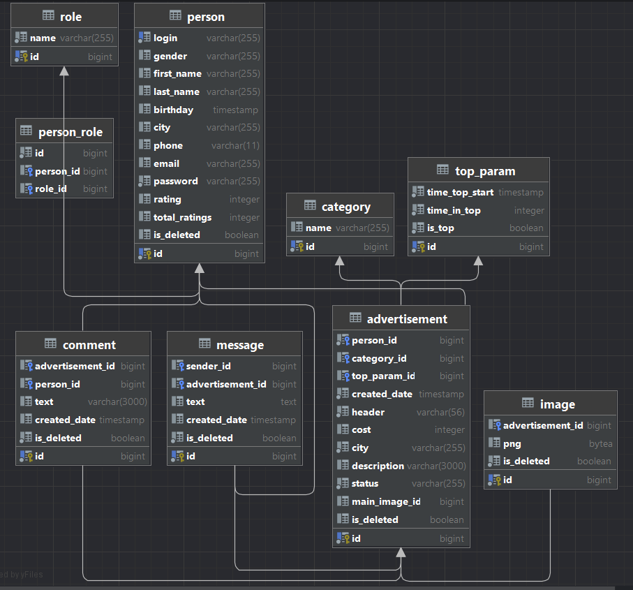

# SENLA_LABS

The final internship project from SENLA

## "The system of placing ads"

## Technologies used

* Backend: Java 17 with Spring Boot 3.2
* Database: PostgreSQL
* ORM: Hibernate
* Security: JWT Spring Security
* Spring Controllers couple REST
* Maven as project builder
* Luquibase for migrations

## Shema

## Setup

1. Install Docker and Docker compose on Windows of Linux: ``https://habr.com/ru/companies/vdsina/articles/496804/``
2. Copy project from GitHub: ``git clone git@github.com:nast9ln/senla-labs.git``
3. Go to the project folder: ``cd senla-labs``
4. Run docker compose file: ``docker-compose up -d``
5. Use postman to check functionality

5. Change the characteristics of being in the top

